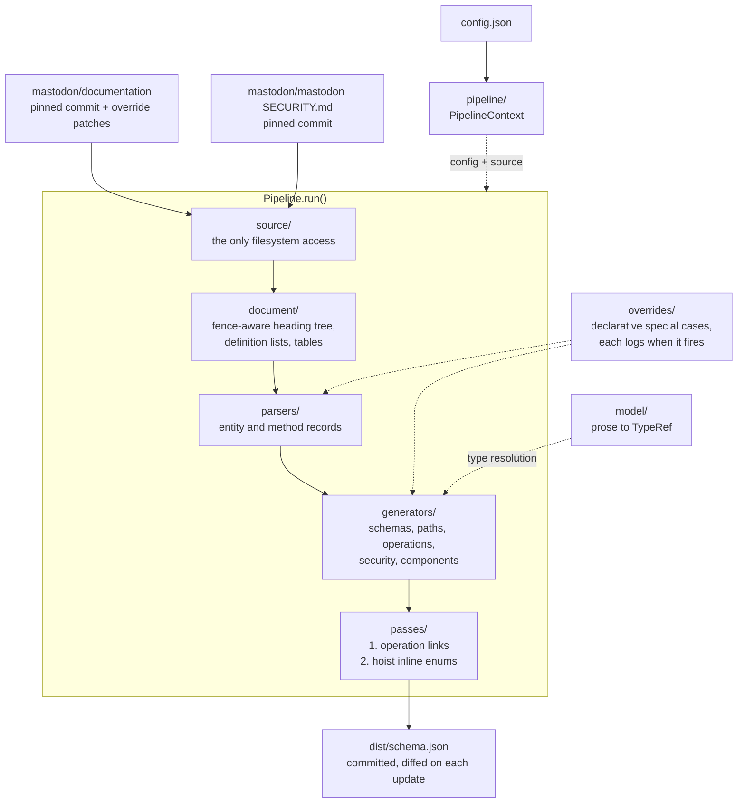

# mastodon-openapi

A tool for generating OpenAPI schemas from the [Mastodon](https://joinmastodon.org/) [API documentation](https://github.com/mastodon/documentation). Created for for the [mastodon](https://github.com/abraham/mastodon-dart) dart package.

## Goal

Generate the most accurate OpenAPI spec for the current stable release of Mastodon.

## Features

- Parses Mastodon entity files and API method documentation
- Generates OpenAPI 3.1.0 compliant schemas
- Automatic weekly schema updates via GitHub Actions

## How it works

Generation is a single ordered pipeline over a vendored copy of the Mastodon
documentation pinned to an exact commit. `src/source/` is the only code that touches the
filesystem, and it hands raw markdown to `src/document/`, which splits each page into a
heading tree that is aware of fenced code blocks, so a `##` line inside a JSON or HTTP
sample cannot be mistaken for a section. `src/parsers/` read that tree into plain entity
and method records, `src/model/` resolves each documented type once into a typed `TypeRef`
rather than re-reading prose later, and `src/generators/` turn those records into OpenAPI
fragments — schemas, paths, operations, security requirements and shared components.
Anything that needs a view of the finished document runs afterwards as an explicit pass in
`src/passes/`: operation links, then hoisting every inline enum into a shared component.
The stage order is declared in one place (`OpenAPIGenerator.stages()`) and the whole
sequence is composed by `src/pipeline/Pipeline.ts`. Mastodon-specific special cases live as
reviewable data in `src/overrides/`, and every one of them logs a line when it fires, so
the amount of hand-maintained special-casing — including bugs deliberately preserved to
keep output stable — is visible in build output. The result is written to
`dist/schema.json`, which is committed, so regenerating shows exactly what a documentation
update changed.



## Usage

### Update documentation version

```bash
npm run update-docs
```

Updates `mastodonDocsCommit` and `mastodonSecurityCommit` in `config.json`, then re-applies
the documentation overrides and re-downloads the pinned `SECURITY.md`.

### Supported versions

The Mastodon version range targeted by the schema is read from
[mastodon/mastodon `SECURITY.md`](https://github.com/mastodon/mastodon/blob/main/SECURITY.md),
pinned by `config.json#mastodonSecurityCommit` and vendored into `mastodon-security/` by
`npm run setup-security-policy` (also run on `postinstall`). Rows marked with an expiry date
count as supported regardless of the date, so generation depends only on the pinned commit
and never on the current date.

### Generate Schema

```bash
npm run generate
```

This will generate an OpenAPI schema at `dist/schema.json` based on the latest Mastodon documentation.

### Validate Schema

```bash
npm run validate
```

### Run Tests

```bash
npm test
```

### Start Development Server

```bash
npm start
```

## Automatic Updates

The repository includes a weekly GitHub Actions workflow that:

1. Automatically generates a new schema every Sunday at 8:00 AM UTC
2. Compares the new schema with the current one
3. Creates a pull request if changes are detected

The workflow can also be triggered manually from the GitHub Actions page.
